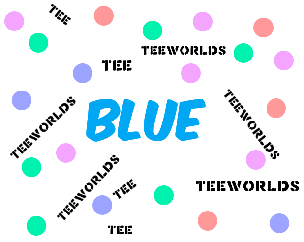

<p align="center"> 
    <a href="https://github.com/BlueFlex/">
         
        <h2 align="center">BlueFlex</h2>
    </a>
</p>


<details>
  <summary>
    📊 GitHub Stats
  </summary>
  <a href="https://github.com/anuraghazra/github-readme-stats">
    
  </a>
</details>
<details>
  <summary>
    📈 GitHub Top Languages
  </summary>
  <a href="https://github.com/anuraghazra/github-readme-stats">
    
  </a>
</details>
<details>
    <summary>
      💥 WebSite
    </summary>
  <a href="https://github.com/anuraghazra/github-readme-stats">   
      
  </a>
</details>
<details>
    <summary>
    🏆 Github Trophies
    </summary>
  <a href="https://github.com/ryo-ma/github-profile-trophy">
    
  </a>
</details>  

> are you a programmer?

[@Reptora7TB](github.com/Reptora7TB)

*About*:


*I*:
```
*** I'm C/C++ beginner.
```

### Languages and Tools:


